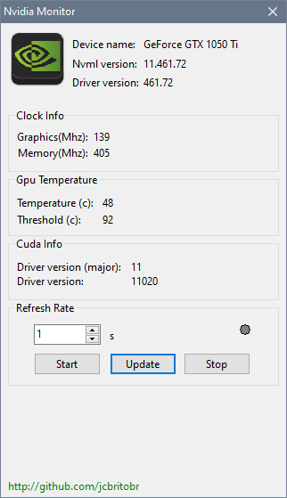

# 

### The nvidia monitoring library object pascal wrapper. Please, read the [documentation](https://docs.nvidia.com/deploy/nvml-api/nvml-api-reference.html#nvml-api-reference) for better understand what is nvml.

* Example on how to get nvidia driver version
```pascal
var
  version: Ansistring;
begin
  try
    NvInitV2;
    version := NvSystemGetDriverVersion;
    if Length(version) = 0 then
    begin
      raise ENvSystemException.Create('Something may fail acquiring driver version. Length is zero');
    end;
    NvShutDown;
  except
    on E: ENvSystemException do
    begin
      NvShutDown;
      Fail(e.Message);
    end;
  end;
```

* Example on how to retrieve gpu temperature
```pascal
var
  device: NvHandle;
  temp: Cardinal;
begin
  try
    NvInitV2;
    device := NvDeviceGetHandleByIndexV2(0);
    temp := NvDeviceGetTemperature(device, nvTemperatureGpu);
    NvShutDown;
  except
    On E: ENvSystemException do
    begin
      NvShutDown;
      Fail(e.Message);
    end;
  end;

```

* The wrapper is in working status. Below we have a list of migrated modules
- [x] Ititialization and Cleanup
- [x] System Queries
- [ ] Device Queries
- [ ] Unit Queries
- [ ] Unit Commands
- [ ] Device Commands
- [ ] Event Handling Methods
- [ ] Error Reporting

* Demo Project - There is also a [demo project(Monitor)](monitor/monitor.pas) that shows how to use nvml api.




